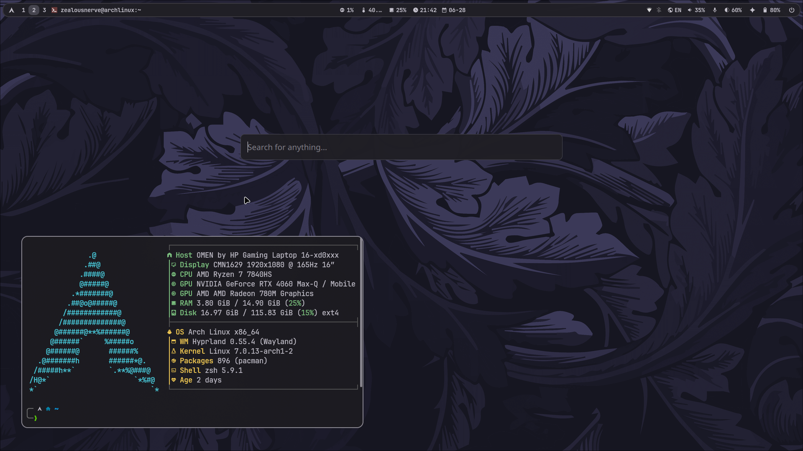

<div align="center">


<br/>


<br/>

> *A fully hand-tuned Arch Linux + Hyprland environment.*
> *Every config file is intentional. Nothing is default.*

</div>

---

## Preview



> Waybar on top. Clean workspace. Deep navy botanical wallpaper.
> Everything themed through **matugen** — colors flow from wallpaper to every app automatically.

---

## Stack

| Role | Tool |
|---|---|
| OS | Arch Linux |
| Window Manager | Hyprland (Lua config) |
| Bar | Waybar |
| Terminal | Kitty |
| Shell | Zsh + Oh My Zsh + Powerlevel10k |
| Launcher | Rofi |
| Notifications | swaync |
| Logout | wlogout |
| Lock Screen | hyprlock |
| Idle Daemon | hypridle |
| Color Engine | matugen (Material You) |
| File Manager | Dolphin + Nautilus |
| Screenshot | Flameshot + Satty |
| Wallpaper | Waypaper |
| System Monitor | btop + htop |
| Audio Visualizer | cava |
| Performance Overlay | MangoHud |
| Fetch | fastfetch |
| GTK Theme | Custom via matugen templates |
| Qt Theme | qt5ct + qt6ct |
| Clipboard | Rofi clipboard manager |

---

## Structure

```
~/.config/
├── hypr/
│   ├── hyprland.lua          ← entry point
│   └── hyprland/
│       ├── general.lua       ← gaps, borders, blur, animations
│       ├── keybindings.lua   ← all keybinds
│       ├── autostart.lua     ← apps launched on login
│       ├── rules.lua         ← window rules
│       ├── monitors.lua      ← display config
│       └── colors.lua        ← accent colors (matugen driven)
├── waybar/
│   ├── config.jsonc          ← modules and layout
│   ├── styles.css            ← full styling
│   └── colors.css            ← wallpaper-synced palette
├── matugen/
│   └── templates/            ← auto-generates themes for every app
├── rofi/                     ← launcher, clipboard, wallpaper picker
├── swaync/                   ← notification center
├── wlogout/                  ← logout screen with custom icons
├── kitty/                    ← terminal, splits, hints, zoom
├── bin/                      ← 16 custom shell scripts
│   ├── brightness-control.sh
│   ├── volume-control.sh
│   ├── change-wall.sh        ← wallpaper + matugen trigger
│   ├── screenshot-*.sh
│   └── ...
└── environment.d/
    └── nvidia.conf           ← NVIDIA Wayland env vars
```

---

## The Color System

This setup uses **matugen** — a Material You color engine that reads your wallpaper and generates a consistent palette across every single app automatically.

Change your wallpaper → run matugen → **everything recolors**:
Waybar, Kitty, Rofi, swaync, wlogout, GTK, Qt, cava, hyprland borders — all of it.

Templates live in `~/.config/matugen/templates/`.

---

## Shell

**Zsh** with Oh My Zsh and Powerlevel10k prompt.

Plugins active:
- `zsh-autosuggestions` — ghost text completions
- `zsh-syntax-highlighting` — inline syntax colors
- `git` — git status in prompt
- `archlinux` — pacman aliases
- `dirhistory` — Alt+Left/Right to navigate directory history

Key aliases:
```zsh
alias ls="lsd"                          # better ls
alias la="lsd --long --all"             # full listing
alias lt="lsd --tree"                   # tree view
alias ff="fastfetch"                    # system info
alias psu="sudo pacman -Syuu"           # full system upgrade
alias prime="__NV_PRIME_RENDER_OFFLOAD=1 __GLX_VENDOR_LIBRARY_NAME=nvidia"
alias dotfiles='/usr/bin/git --git-dir=$HOME/.dotfiles/ --work-tree=$HOME'
```

---

## Installation

> **Warning:** Don't blindly copy these configs. Read them first. Some files are specific to my hardware (NVIDIA GPU, monitor layout). Adapt before applying.

### 1. Clone

```bash
git clone --bare https://github.com/ZealousNerve/dotfiles.git ~/.dotfiles

alias dotfiles='/usr/bin/git --git-dir=$HOME/.dotfiles/ --work-tree=$HOME'
```

### 2. Checkout

```bash
dotfiles checkout
dotfiles config --local status.showUntrackedFiles no
```

If checkout throws conflicts, back up your existing configs first:
```bash
mkdir -p ~/.config-backup
# move conflicting files there, then re-run checkout
```

### 3. Install packages

```bash
yay -S --needed - < ~/.config/pkglist.txt
```

### 4. Apply colors

```bash
matugen image /path/to/your/wallpaper.png
```

### 5. Launch Hyprland

```bash
Hyprland
```

---

## Hardware

Configs tuned for:

| | |
|---|---|
| CPU | AMD Ryzen 7 7840HS |
| GPU | NVIDIA RTX 4060 (PRIME offload configured) |
| Display | 1080p / 144Hz |
| Boot | External SSD |

If your GPU or monitor setup differs, check:
- `~/.config/hypr/hyprland/monitors.lua`
- `~/.config/environment.d/nvidia.conf`

---

## Notes

- Hyprland config is written entirely in **Lua** — no `.conf` files for the main WM config
- All scripts in `~/.config/bin/` are POSIX-friendly and commented
- The `.env.example` in `bin/` shows what variables the screenshot upload scripts need
- `wireplumber` config tweaks ALSA for proper audio routing on this hardware

---

<div align="center">

**built on Arch. tuned by hand. themed by wallpaper.**

*If something breaks on your machine — read the config. The answer is in there.*

<br/>

[](https://github.com/ZealousNerve)
[](https://linkedin.com/in/zealousnerve)

</div>
